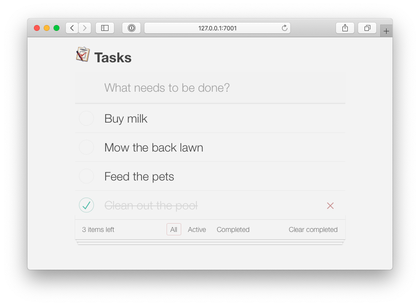

# Course materials for Coherence To Do List (Helidon) workshop

>This is a complete, final implementation of the application created during the workshop.
 > 
 >To switch to the starting point for the workshop, check out the `start` branch:
 > 
 >```bash
 > git checkout start
 > ```
 >        
>Open the project in the IDE of your choice, and follow the [lab instructions](https://aseovic.medium.com/coherence-to-do-list-helidon-19f68bef245f).  

## Instructions
  
### Build the project

```bash
mvn clean package
```

### Run the Application

```bash  
mvn exec:exec
```
### Build a Docker Image

```bash
mvn clean install
mvn package -P docker 
```

### Run the Docker Container

```bash
docker run -d -p 1408:1408 -p 7001:7001 -P 7002:7002 ghcr.io/coherence-community/todo-list-helidon-server
```

> NOTE: `7001` is the HTTP port, and `7002` is the metrics port. `1408` is the gRPC port.

### Access the Web UI

Access via http://localhost:7001/



### Query the GraphQL Endpoint

The GraphQL Endpoint is available at http://localhost:7001/graphiql.html.

To retrieve a collection of tasks, use the following query:

```graphql
query {
  tasks(completed: false) {
    id
    description
    completed
    createdAt
    createdAtDate
  }
}
```

## References

* [Coherence CE](https://coherence.community/)
* [Helidon](https://helidon.io/)


